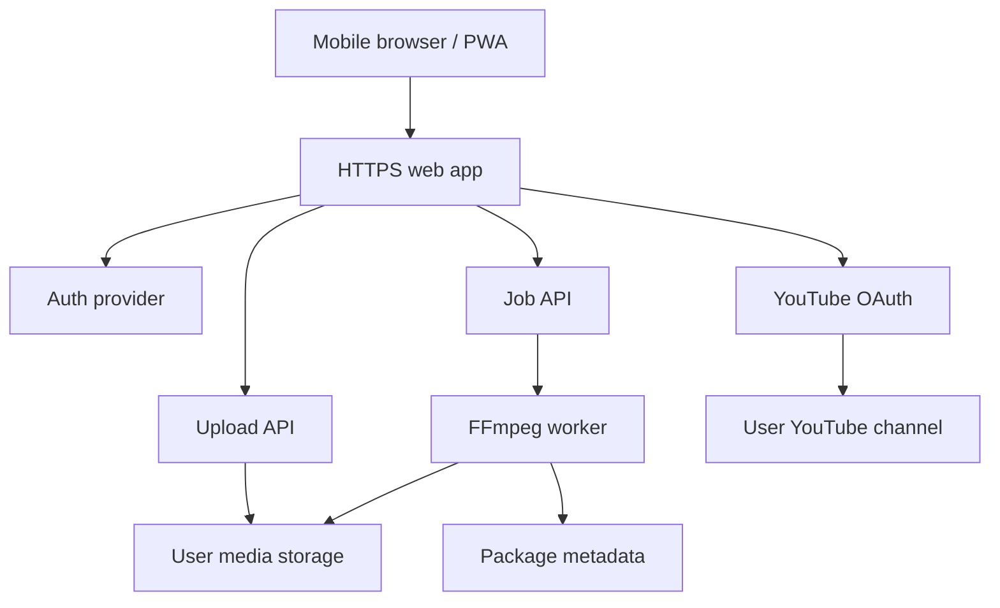

# Multi-User Cloud Web App Architecture

## Goal

Turn the local YouTube Bird Studio into a cloud web app that multiple mobile users can access with their own media, editing jobs, and YouTube account connection.

## MVP Architecture

## Required Production Pieces

- HTTPS domain.
- Real login, initially Google OAuth.
- Per-user workspace isolation.
- Persistent media storage.
- Background worker for FFmpeg jobs.
- Per-user YouTube OAuth token storage.
- Upload size limits and storage quotas.
- Copyright/license evidence per music asset.
- Privacy policy and terms of service.

## Current Prototype State

- Local web dashboard exists.
- Multi-user `user_id` workspace separation exists.
- Public cloud mode can derive the user workspace from an authenticated user header.
- File upload, package listing, subtitle rendering exist.
- YouTube upload exists for the local owner account.
- Public cloud mode refuses to start unless HTTPS URL, non-local auth mode, and session secret are configured.

## Not Yet Production Ready

- The current `user_id` field is not authentication.
- In public cloud mode, authentication must be handled by Google IAP, Cloudflare Access, or another trusted reverse proxy before traffic reaches the app.
- Uploaded media is stored on local disk, not object storage.
- FFmpeg jobs run inside the web process.
- YouTube OAuth is not yet per-user.
- No rate limits, quota enforcement, malware scan, or abuse reporting.

## Recommended Next Build Steps

1. Put the app behind Google IAP or Cloudflare Access and pass a verified user email header.
2. Move uploads to object storage.
3. Add a job queue and FFmpeg worker.
4. Store YouTube OAuth tokens per user.
5. Add billing/limits before public launch.

## Auth Header Mode

The app does not trust browser-provided `user_id` in public cloud mode. It reads the authenticated user from a trusted header:

- `AUTH_USER_HEADER=X-Goog-Authenticated-User-Email` for Google IAP.
- `AUTH_USER_HEADER=Cf-Access-Authenticated-User-Email` for Cloudflare Access.
- `AUTH_USER_HEADER=X-Authenticated-User` for a custom reverse proxy.

Only deploy this mode when the app is not directly reachable without the auth proxy.
